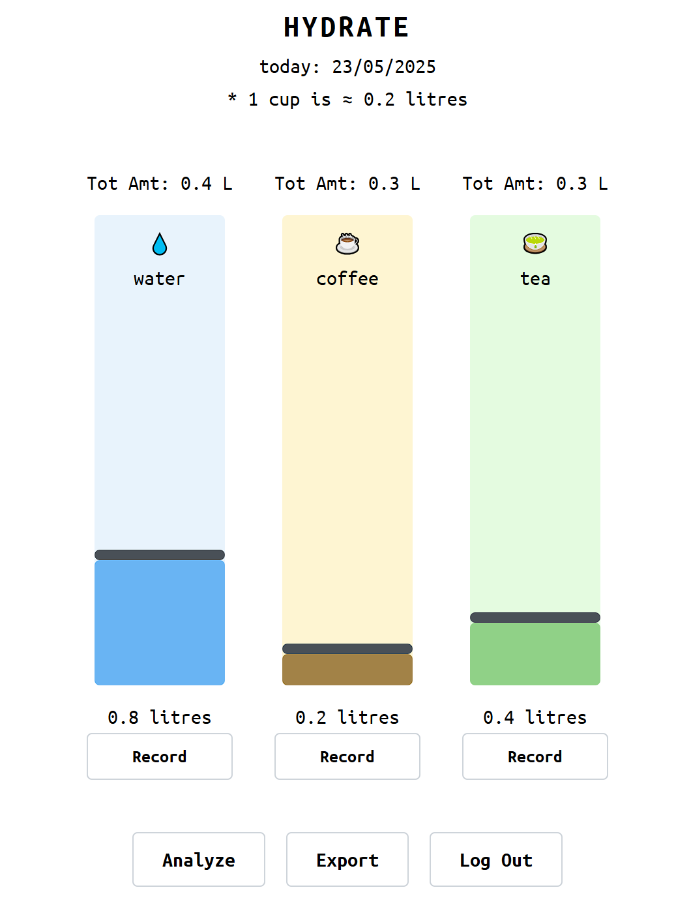
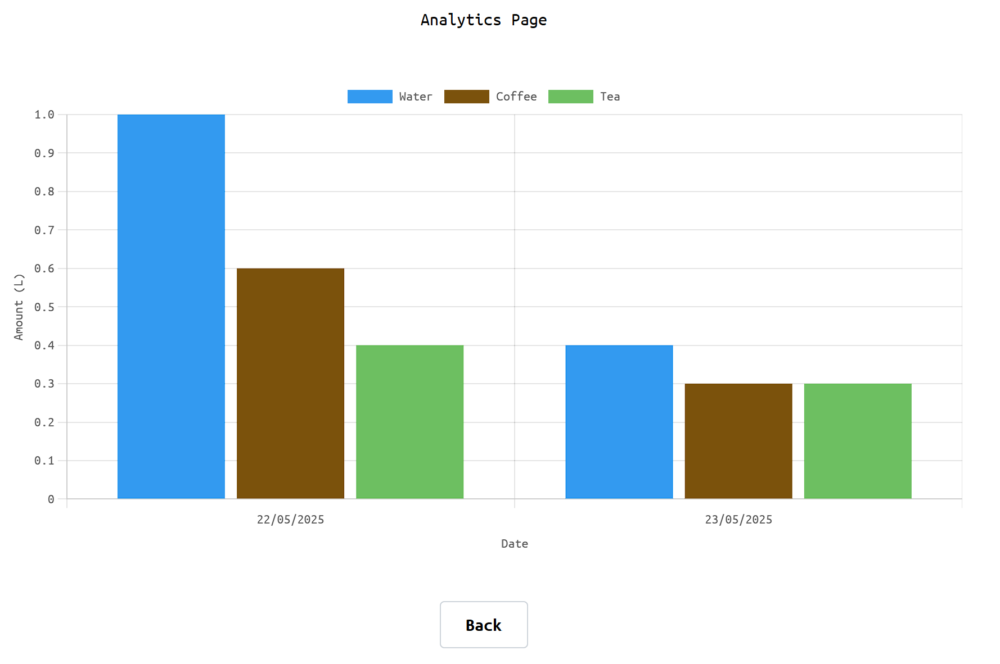

# Description  
Track and analyze your daily hydration levels across your favorite drinks — including water, coffee, and tea — with ease and precision using **Hydrate**.  

Visit Hydrate [here](https://hydrate-me.vercel.app)

This hydration tracker lets users log their fluid intake, visualize their consumption patterns, and maintain healthier habits. Built with a clean, responsive UI and secure user authentication, each user gets a personalized experience with private hydration logs.  

## How It Works

Record daily hydration levels for any of the default beverages (water, coffee and tea), using the vertical sliders. The dynamic and responsive UI will update the total amount, in litres, of the beverage drank. The database will also be updated to allow users to seamlessly fetch their hydration logs daily. Use the export feature to download the hydration logs as a .txt file.  

      

 

Use the analytics page to look at hydration logs and visualize consumption patterns for the past 7 days. 

      

 

# Features  
- 🔐 **Secure Authentication** via passwordless email OTP using **Supabase Auth**
- 🧾 Individual Hydration Logs with **Supabase Postgres Database**
- ☁️ **Cloud-based Storage & API** using **Supabase** as the backend-as-a-service (BaaS)
- 🥤 Multi-beverage Tracking (water, coffee, tea) using a dynamic **React + TypeScript** frontend
- 📈 Visual Feedback & Tracking UI built using **Mantine UI** components and **ChartJS** for a clean, responsive experience
- 💬 **Express.js** Backend Integration (optional/custom APIs) for extensibility
- 🚀 **Deployed on Vercel** for seamless, fast, and free hosting with continuous deployment from GitHub

# Tech Stack  
This section highlights the tech stack used for this project.  

# Future Work  
This section highlights some of the new features that may be implemented in future releases.  

- Dynamic addition of new beverages other than the default ones (water, coffee, tea).
- Dynamic deletion of current beverages on the home page.
- Customization of vertical sliders (bgcolor, fill color, etc.) for beverages.